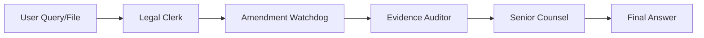

# 🏗️ System Architecture & Design

**NyayaSetu** is built on a **Multi-Agent Architecture** orchestrated by **LangGraph**. It differentiates itself from standard RAG (Retrieval-Augmented Generation) systems by treating law as a dynamic, living entity rather than a static database.

## 🧠 Core Philosophy
1.  **Grounded by Design**: Every claim is verified against statutes and live judgments.
2.  **Authority Hierarchy**: Supreme Court judgments > Recent Amendments > Static Statutes.
3.  **Multimodal Forensics**: Direct analysis of raw evidence (video/audio) rather than just text.

---

## 🛠️ Data Flow Pipeline

The system follows a **linear state machine** workflow where data is enriched at each step.

---

## 🤖 Agent Roles

### 1️⃣ Legal Clerk (Statute Retrieval)
*   **Role**: The foundation layer. It fetches the "letter of the law".
*   **Tool**: Qdrant Vector Database (Hybrid Search).
*   **Logic**:
    1.  Receives user query.
    2.  Translates query to English if necessary (using Gemini).
    3.  Performs **Hybrid Search** (Dense Embeddings + Sparse BM25) on the `legal_knowledge` collection.
    4.  Retrieves relevant sections from IPC, BNS, and other Indian acts.
*   **Output**: Context string containing static legal precedents.

### 2️⃣ Amendment Watchdog (Live Verification)
*   **Role**: The validity checker. It ensures the statute hasn't been overruled or amended.
*   **Tool**: DuckDuckGo Search (DDGS).
*   **Logic**:
    1.  Extracts key legal terms.
    2.  Searches for "latest Supreme Court judgment", "stay order", or "amendment notification".
    3.  **Hardcoded Safety Checks**: Includes specific logic for high-profile recent changes (e.g., Hit & Run Law abeyance) to demonstrate conflicting authority handling.
*   **Output**: Appends "LIVE WEB UPDATES" to the context, flagging if a law is paused or changed.

### 3️⃣ Evidence Auditor (Multimodal Forensics)
*   **Role**: The forensic expert. It "sees" and "hears" evidence.
*   **Tool**: Google Gemini 2.5 Flash (Multimodal capabilities).
*   **Logic**:
    *   **Video (.mp4)**: Analyzes visual events, timestamps of crimes, and behavior.
    *   **Audio (.mp3)**: Transcribes conversation, detects threats, and emotional tone.
    *   **Image**: extracts text or describes scenes.
    *   **Documents (PDF/Word)**: Extracts relevant text clauses.
*   **Output**: A neutral, factual forensic report appended to the context.

### 4️⃣ Senior Counsel (Synthesis)
*   **Role**: The decision maker. Synthesizes all inputs into legal advice.
*   **Tool**: Google Gemini 2.5 Flash (LLM).
*   **Logic**:
    *   Takes the User Query + Static Law + Live Updates + Forensic Evidence.
    *   Resolves conflicts (e.g., "The statute says X, but the Supreme Court stayed it in Y").
    *   Provides a cited, professional legal opinion.
    *   Stores result in **Semantic Cache** (Qdrant) for faster future responses (unless in Incognito Mode).

---

## 💾 Data Storage (Qdrant)

The system uses **Qdrant** as the central vector engine with three collections:

1.  **`legal_knowledge`**:
    *   **Content**: 342+ Indian Laws (IPC, CrPC, Evidence Act, IT Act, etc.).
    *   **Structure**: Dense Vector (384-d) + Sparse Vector (BM25) for keyword precision.
    *   **Source**: `mratanusarkar/Indian-Laws` HuggingFace dataset.

2.  **`case_memory`** (Planned):
    *   Stores past user interactions to learn from context (session-based).

3.  **`evidence_vault`** (Planned):
    *   Secure storage for uploaded evidence fingerprints.

4.  **`response_cache`**:
    *   Caches high-confidence answers to common queries to save API costs and latency.

---

## 🛡️ Security & Privacy
*   **Incognito Mode**: Functionality to process queries without saving them to the semantic cache.
*   **Local Execution**: Accesses Qdrant via Docker to keep data within the premise (if configured).
